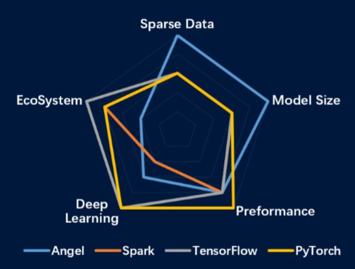
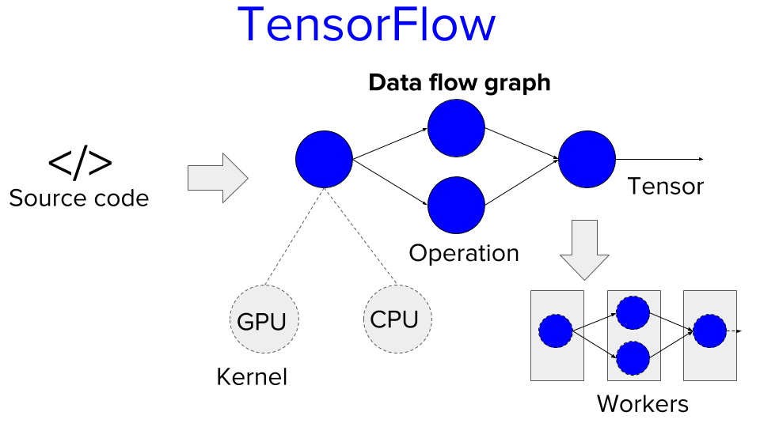
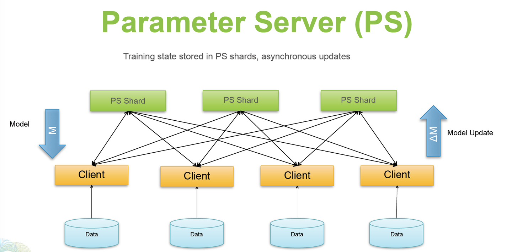

# Distributed Machine Learning Systems: A Study

## Abstract
The growing computational cost of training machine learning models has made distributed processing essential in modern artificial intelligence research and applications. This proposal explores the categorization of distributed machine learning (ML) frameworks based on communication topologies: iterative MapReduce/AllReduce, parameter servers, and data flow-based systems. We provide a comparative analysis of representative frameworks, such as Spark MLlib, TensorFlow, and Microsoft Multiverso, emphasizing their design principles, strengths, and challenges. The findings aim to guide researchers and practitioners in selecting suitable frameworks for various ML tasks.

## 1. Introduction
The rapid growth in machine learning (ML) data and model complexity has driven the need for distributed computing to meet scalability demands. These systems rely on communication topology to manage how information is shared and synchronized across nodes, impacting performance, scalability, and fault tolerance. This paper categorizes ML frameworks based on their communication topologies and evaluates their effects on distributed ML systems.

Key features of these frameworks include ease of use, with shared parameters for efficient computation; asynchronous communication, which balances algorithm convergence and system efficiency; elastic scalability, allowing dynamic node addition without system restart; and fault tolerance, ensuring reliability even with inevitable node failures. For example, with an MTBF of three years, a system with 1,000 nodes may experience one failure per day. Scheduler pre-emption can further increase this failure rate in industrial deployments. These design choices are essential for optimizing the performance and robustness of distributed ML systems.

Comparison of different frameworks : Angel represents the Parameter Server, Spark exemplifies MapReduce, and TensorFlow and PyTorch embody the Data Flow.
## 2. Mainstream frameworks in Distributed ML

### 2.1 Iterative MapReduce/AllReduce
Frameworks using the iterative MapReduce or AllReduce topology rely on aggregating intermediate results across distributed nodes. Popular examples include Apache Spark's MLlib and MPI-based systems.

- **Design**: Nodes perform local computations, followed by aggregation across the cluster.
- **Strengths**: Well-suited for tasks involving batch processing and iterative computations.
- **Challenges**: Limited by communication overhead and lack of support for dynamic model updates.
- **Example**: Spark MLlib utilizes Resilient Distributed Datasets (RDDs) to enable fault-tolerant parallelism.

### 2.2 Parameter Server
The parameter server topology distributes ML tasks across worker nodes and servers managing global parameters. Examples include the Parameter Server from Carnegie Mellon University (CMU), Petuum, and Microsoft's Multiverso.

- **Design**: Worker nodes perform gradient computations, while server nodes manage parameter updates asynchronously or synchronously.
- **Strengths**: Scalability for large-scale models and flexibility in update strategies.
- **Challenges**: Synchronization delays and potential bottlenecks at the server nodes.
- **Example**: Microsoft's Multiverso enhances training efficiency by supporting dynamic scheduling and fault tolerance.

### 2.3 Data Flow
Data flow-based systems represent computations as directed acyclic graphs (DAGs) of operations. Google's TensorFlow is the most prominent example in this category.

- **Design**: Nodes represent operations, and edges indicate data dependencies, enabling parallel execution and dynamic task scheduling.
- **Strengths**: Flexibility in expressing complex ML models and compatibility with hardware accelerators.
- **Challenges**: Overhead in DAG scheduling and debugging complexity.
- **Example**: TensorFlow supports automatic differentiation and seamless integration with GPUs/TPUs for accelerated training.

## 3. Comparative Analysis

| Topology           | Strengths                               | Weaknesses                           | Representative Frameworks | Use Cases                       |
|--------------------|-----------------------------------------|--------------------------------------|---------------------------|---------------------------------|
| **MapReduce/AllReduce** | Simple aggregation, fault tolerance    | Communication overhead, static workflows | Spark MLlib, MPI-based tools | Batch learning, iterative tasks |
| **Parameter Server**   | Scalable, flexible update mechanisms  | Synchronization bottlenecks, fault recovery | Petuum, Multiverso         | Deep learning, large-scale ML  |
| **Data Flow**          | Expressiveness, hardware acceleration   | Scheduling overhead, debugging complexity | TensorFlow, PyTorch        | Dynamic tasks, complex models   |
